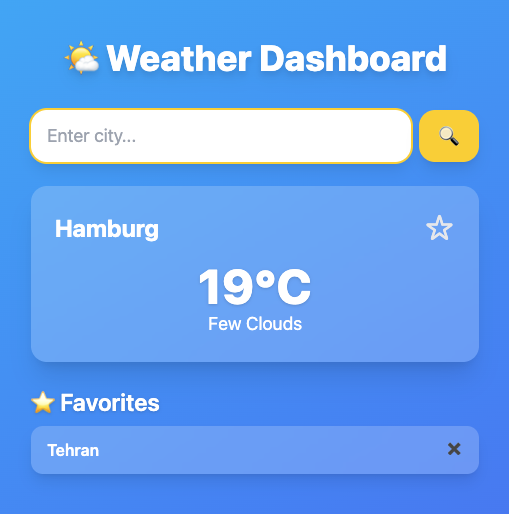

# 🌤 Weather Dashboard

A simple, modern weather app built with **React** (frontend) and **Node.js + Express + PostgreSQL** (backend).  
Users can search for cities, view current weather, and save favorite cities.

---

## 🚀 Features
- 🔍 Search weather by city name (powered by OpenWeather API)  
- ⭐ Save and remove favorite cities (stored in PostgreSQL)  
- 📱 Responsive UI (mobile-friendly design with Tailwind CSS)  
- ⚡ Fast and lightweight (uses Fetch API, no Axios required)  

---

## 🛠️ Tech Stack
- **Frontend:** React, Tailwind CSS, Fetch API  
- **Backend:** Node.js, Express.js, PostgreSQL  
- **API:** [OpenWeather](https://openweathermap.org/api)  

---

## 📂 Project Structure

weather-dashboard/
├── client/              # React frontend
│   ├── src/
│   │   ├── App.js
│   │   ├── SearchBar.jsx
│   │   ├── WeatherCard.jsx
│   │   └── index.js
│   └── package.json
├── server/              # Express backend
│   ├── index.js
│   └── package.json
├── .gitignore
├── README.md
└── package.json


---

## ⚙️ Setup & Installation

### 1. Clone the repo
```bash
git clone https://github.com/SaeidehSadatHosseini/weather-dashboard.git
cd weather-dashboard

2. Install dependencies

Frontend:

cd client
npm install


Backend:

cd ../server
npm install


3. Set up environment variables

Create a .env file in server/:

REACT_APP_WEATHER_API_KEY=your_openweather_api_key
DB_USER=postgres
DB_HOST=localhost
DB_NAME=weather_app
DB_PASS=your_password
DB_PORT=5432
PORT=5050


4. Start the app

Run backend:

cd server
node -r dotenv/config index.js


Run frontend:

cd ../client
npm start


Open in browser 👉 http://localhost:3000


## 🎨 Screenshots

### Dashboard


### Favorites


<p>
</p>

